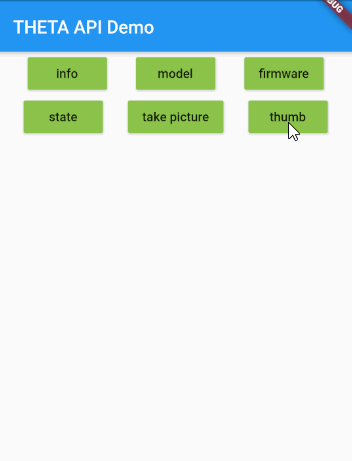

# THETA WebAPI Flutter Test



Demonstration of THETA WebAPI Tester.

[theta WebAPI package](https://github.com/theta360developers/webapi/tree/master/packages/theta)

## Example implementation

```dart
  void _info() async {
    _displayResponse(await Camera.info);
  }

...
MaterialButton(
    onPressed: _info,
    child: Text('info'),
    color: Colors.lightGreen,
),
```
